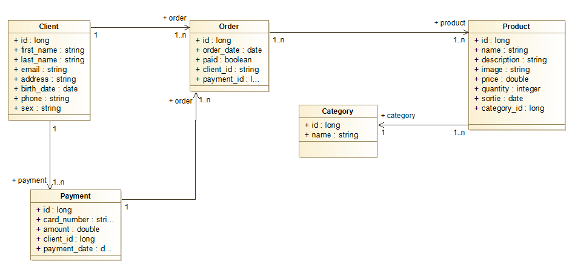

# ecommerce_backend
## Getting Started
Just run the application after loading maven.

## The UML Diagram 

## The api specification
(Click here)(https://petstore.swagger.io/?url=https://raw.githubusercontent.com/Anjaraniaina/ecommerce-backend/main/doc/api.yaml)